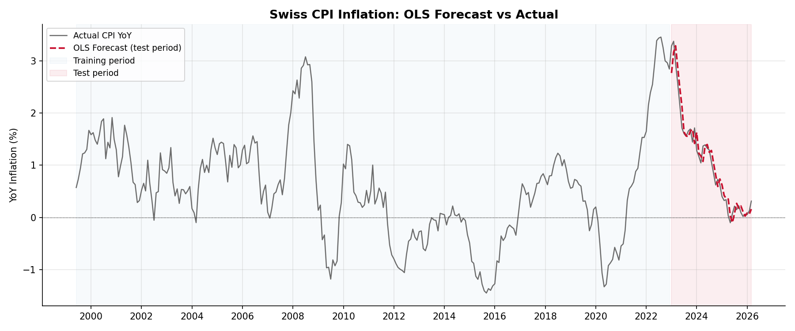
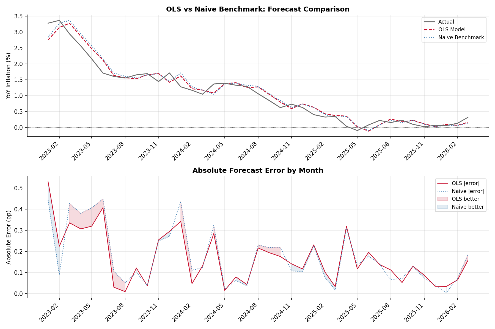
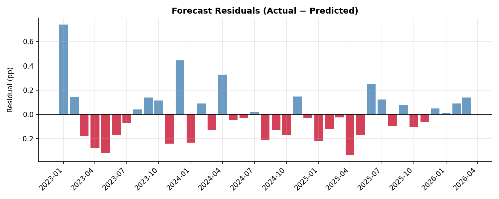
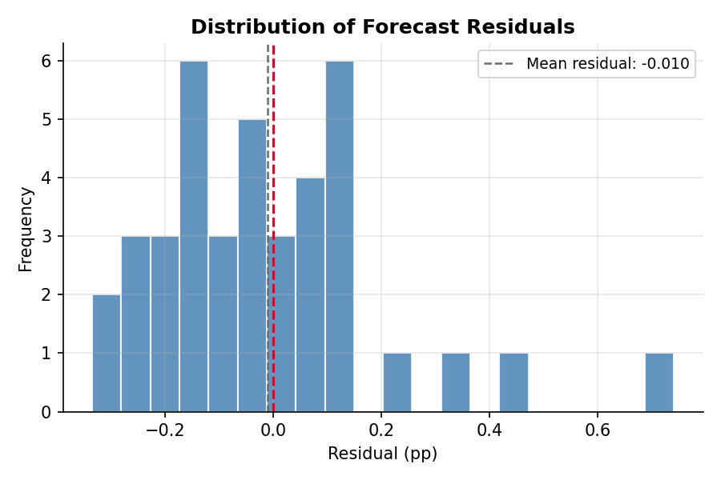

# Swiss Inflation Forecast

An OLS model that forecasts Swiss CPI inflation (YoY) one month ahead using macroeconomic indicators. Built to be easily extensible — adding a new variable requires only editing `config.yaml`.

## Latest Forecast

**April 2026 → +0.16%** (95% CI: -0.38% to +0.69%)

## Results



| Metric | Value |
|--------|-------|
| R² (in-sample) | 0.922 |
| RMSE (out-of-sample) | 0.206 pp |
| Theil's U2 vs Naive | 0.944 |
| Train period | 1999–2022 |
| Test period | 2023–2026 |

The model beats a naive benchmark (this month = last month) by **5.6%** in RMSE. See [RESULTS.md](RESULTS.md) for a full model comparison across four specifications.

## Model

Reduced-form Phillips Curve estimated with OLS:

$$\pi_t = \alpha + \beta_1 \pi_{t-1} + \beta_2 \Delta e_t + \beta_3 \Delta \ln p_{\text{oil},t} + \varepsilon_t$$

| Variable | Coef | p-value |
|----------|------|---------|
| CPI (lag 1) | 0.966 | 0.000 |
| EUR/CHF change (lag 1) | 1.146 | 0.430 |
| Oil price log-diff (lag 2) | 0.378 | 0.021 |

Heteroskedasticity-robust standard errors (HC3). Although EUR/CHF is not individually significant at the 5% level, model comparison shows it improves out-of-sample accuracy — dropping it worsens Theil's U2 from 0.944 to 0.957.

## Benchmark Comparison



| Metric | OLS | Naive |
|--------|-----|-------|
| MAE | 0.1648 | 0.1725 |
| RMSE | 0.2056 | 0.2177 |
| Theil's U2 | **0.944** | 1.000 |

## Residuals





Mean residual: -0.048 pp — no systematic bias.

## Data Sources

| Variable | Source | File |
|----------|--------|------|
| Swiss CPI (LIK) | [BFS](https://www.bfs.admin.ch) | `data/raw/cpi_bfs_raw.xlsx` |
| EUR/CHF exchange rate | [SNB](https://data.snb.ch) | `data/raw/eurchf_snb_raw.csv` |
| Brent crude oil (EUR) | [FRED](https://fred.stlouisfed.org) | fetched via API |
| Import Price Index | [BFS](https://www.bfs.admin.ch) | `data/raw/import_price_bfs_raw.xlsx` |

## Setup

```bash
git clone https://github.com/YOUR_USERNAME/swiss-inflation-forecast.git
cd swiss-inflation-forecast
python -m venv venv
source venv/bin/activate        # Windows: venv\Scripts\activate
pip install -r requirements.txt
cp .env.example .env            # add your FRED API key
```

Manually place the following files in `data/raw/`:
- `cpi_bfs_raw.xlsx` — downloaded from BFS
- `eurchf_snb_raw.csv` — downloaded from SNB data portal
- `import_price_bfs_raw.xlsx` — downloaded from BFS (IPI)

## Usage

```bash
python src/fetch_data.py       # load/download raw data
python src/preprocess.py       # merge, build features, stationarity check
python src/model.py            # fit OLS, save coefficients
python src/evaluate.py         # metrics and plots
python src/benchmark.py        # compare against naive benchmark
python src/compare_models.py   # compare four model specifications
python src/forecast.py         # forecast next month
```

## Adding a New Variable

Open `config.yaml` and add an entry under `features`:

```yaml
features:
  - name: "snb_rate"
    source: "snb"
    lag: 1
    transform: "diff"
    description: "SNB policy rate, first difference"
```

No other code changes needed.